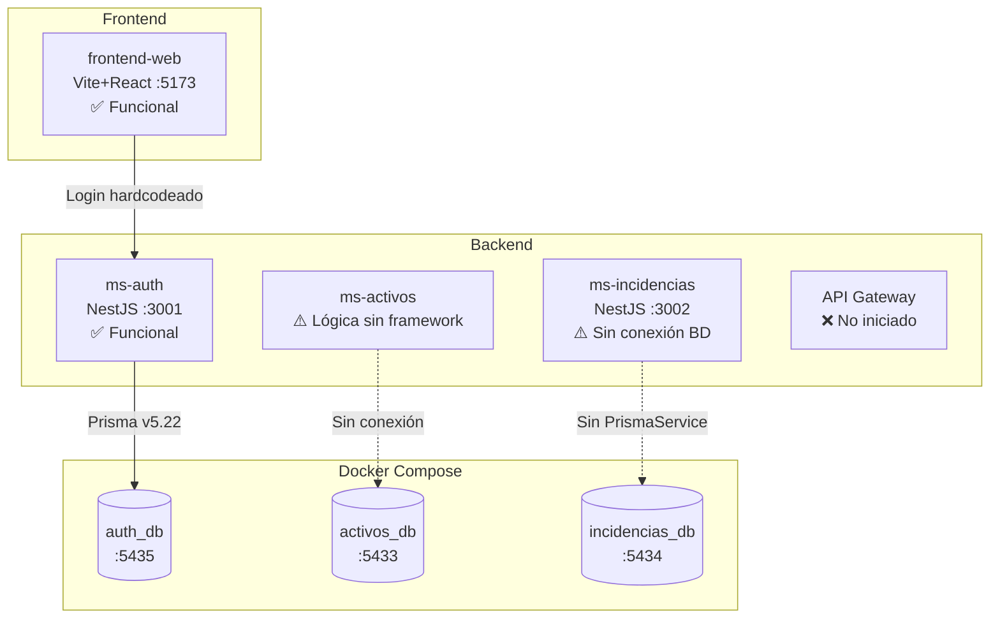

# 🔍 Análisis Profundo del Proyecto — Rama `dev` (Semana 1)

## Resumen Ejecutivo

Se analizaron las **21 tarjetas con etiqueta `Semana-1`** en Jira (TAL-20 a TAL-50) y el código fuente completo en la rama `dev`. El proyecto se encuentra en un **estado funcional sólido** con la gran mayoría de criterios cumplidos. Se detectaron **3 bugs críticos**, **2 incompatibilidades entre microservicios** y **5 observaciones menores**.

---

## 📋 Estado de las Tarjetas con Etiqueta `Semana-1`

### 👤 Ediuh (Infraestructura & MS Incidencias)
| Tarjeta | Título | Status | ¿Cumplida en código? |
|---------|--------|--------|---------------------|
| TAL-20 | Configuración de servicios de BD en Docker | ✅ Finalizada | ✅ Sí — `docker-compose.yml` con 3 contenedores (auth_db, activos_db, incidencias_db) |
| TAL-21 | Scripts de inicialización y persistencia local | ✅ Finalizada | ⚠️ Parcial — No hay volúmenes Docker para persistencia |
| TAL-32 | Inicialización del proyecto MS Incidencias | ✅ Finalizada | ⚠️ Parcial — Scaffolding existe pero falta `PrismaModule` y `.env` |
| TAL-33 | Modelado de la tabla de Incidencias | ✅ Finalizada | ✅ Sí — Modelo `Incidencias` definido en `schema.prisma` |
| TAL-46 | Lógica de verificación de roles específicos (RBAC) | 🟡 Backlog | ❌ Pendiente |

### 👤 bsoto2025 — Benjamin (MS Autenticación)
| Tarjeta | Título | Status | ¿Cumplida en código? |
|---------|--------|--------|---------------------|
| TAL-22 | Inicialización del proyecto MS Autenticación | ✅ Finalizada | ✅ Sí |
| TAL-23 | Modelado de Usuarios y Roles en código | ✅ Finalizada | ✅ Sí — Modelos `User` (UUID) y `Role` con migración |
| TAL-34 | Interceptor de captura de errores no controlados | ✅ Finalizada | ✅ Sí — `AllExceptionsFilter` global |
| TAL-35 | Estructura JSON estándar para errores REST | ✅ Finalizada | ✅ Sí — JSON: `{statusCode, timestamp, path, message}` |

### 👤 Sebastián Rivera (JWT & Seguridad)
| Tarjeta | Título | Status | ¿Cumplida en código? |
|---------|--------|--------|---------------------|
| TAL-28 | Desarrollo de firma y encriptación de tokens JWT | ✅ Finalizada | ✅ Sí — `AuthService` con `argon2` + `@nestjs/jwt` |
| TAL-29 | Middleware de validación de claims JWT | ✅ Finalizada | ✅ Sí — `JwtAuthGuard` con validación de payload |

### 👤 Axel González (Frontend Core & Routing)
| Tarjeta | Título | Status | ¿Cumplida en código? |
|---------|--------|--------|---------------------|
| TAL-24 | Estructura de carpetas y framework Frontend | ✅ Finalizada | ✅ Sí — Vite + React + TailwindCSS |
| TAL-26 | Configuración del enrutador principal web | ✅ Finalizada | ✅ Sí — `react-router-dom` con rutas públicas/privadas |
| TAL-30 | Consumo de endpoint de login desde Frontend | ✅ Finalizada | ⚠️ Parcial — URL del backend hardcodeada |
| TAL-50 | Componente visual Toast/Snackbar | ✅ Finalizada | ✅ Sí — `ToastContext` + `Toast.jsx` con 3 tipos |

### 👤 Eduardo Necul (Frontend Vistas)
| Tarjeta | Título | Status | ¿Cumplida en código? |
|---------|--------|--------|---------------------|
| TAL-25 | Desarrollo del Layout Maestro estático | ✅ Finalizada | ✅ Sí — `Layout.jsx` con Header, Sidebar y `<Outlet/>` |
| TAL-27 | Maquetación estática del inicio de sesión | ✅ Finalizada | ✅ Sí — `Login.jsx` con inputs, validación visual y toggle login/register |
| TAL-38 | Maquetación del formulario de reporte | ✅ Finalizada | ✅ Sí — `FormularioReporteIncidencia.jsx` (603 líneas, muy completo) |
| TAL-39 | Validaciones de formulario y manejo de estado | ✅ Finalizada | ✅ Sí — Validación de campos obligatorios, estado de loading, y feedback visual |

### 👤 Simón Molina (MS Activos & QR)
| Tarjeta | Título | Status | ¿Cumplida en código? |
|---------|--------|--------|---------------------|
| TAL-36 | Endpoint de validación de activo (Escáner QR) | ✅ Finalizada | ⚠️ Parcial — Lógica existe pero no es un endpoint NestJS real |
| TAL-37 | Enlace de redirección para creación de incidencias | ✅ Finalizada | ⚠️ Parcial — Lógica de URLs generada pero no expuesta como REST |

---

## 🐛 Bugs Críticos Detectados

### 1. Import fantasma de FastifyAdapter en `main.ts` (ms-auth)

**Archivo:** [main.ts](file:///c:/Users/bsd28/Documents/GitHub/Taller-Integracion-II/ms-auth/src/main.ts#L3)

```typescript
import { FastifyAdapter } from '@nestjs/platform-fastify'; // ← Se importa pero NO se usa
```

La aplicación se crea con `NestFactory.create(AppModule)` (Express por defecto), pero se importa `FastifyAdapter`. Además, `auth.controller.ts` y `jwt-auth.guard.ts` usan `import type { FastifyRequest } from 'fastify'`, lo que es **incorrecto** si el servidor corre sobre Express.

> [!CAUTION]
> **Impacto:** El guard JWT escribe en `request.user` asumiendo `FastifyRequest`, pero el servidor usa Express. Funciona "por casualidad" en desarrollo pero es frágil.

---

### 2. `auth.service.ts` usa un cast forzado a `any` para acceder a Prisma

**Archivo:** [auth.service.ts](file:///c:/Users/bsd28/Documents/GitHub/Taller-Integracion-II/ms-auth/src/auth/auth.service.ts#L16)

```typescript
const prisma = this.prisma as any; // ← Bypass total de tipos
```

El cast a `any` elimina toda la seguridad de tipos y autocompletado. Si alguien cambia el modelo `User` en el schema, TypeScript no detectará incompatibilidades aquí.

> [!WARNING]
> **Impacto:** "Time bomb" silencioso — errores de esquema pasarán desapercibidos hasta runtime.

---

### 3. `ms-incidencias` no tiene PrismaModule/PrismaService ni conexión a BD

**Archivo:** [app.module.ts](file:///c:/Users/bsd28/Documents/GitHub/Taller-Integracion-II/ms-incidencias/src/app.module.ts)

El microservicio tiene un `schema.prisma` con el modelo `Incidencias`, pero:
- ❌ **No tiene** `PrismaModule` ni `PrismaService`
- ❌ **No tiene** `ConfigModule`
- ❌ **No tiene** `.env` con `DATABASE_URL`
- ❌ **No tiene** filtro de excepciones global

> [!CAUTION]
> **Impacto:** El microservicio arranca pero **no puede interactuar con la BD**. Es un cascarón vacío.

---

## ⚠️ Incompatibilidades Detectadas

### 1. Versiones de Prisma inconsistentes

| Microservicio | `@prisma/client` | `prisma` (dev) |
|--------------|-------------------|----------------|
| ms-auth | `^5.22.0` | `^5.22.0` |
| ms-incidencias | `6.4.0` | `6.4.0` |

Cada microservicio genera un cliente Prisma con una API potencialmente diferente.

### 2. Gestores de paquetes inconsistentes

| Proyecto | Gestor | Lock file |
|----------|--------|-----------|
| ms-auth | pnpm | `pnpm-lock.yaml` |
| ms-incidencias | yarn | `yarn.lock` |
| frontend-web | npm | `package-lock.json` |

---

## 📝 Observaciones Menores

1. **TAL-21:** El `docker-compose.yml` no define volúmenes persistentes. Un `docker compose down` borra todos los datos.

2. **TAL-30:** El componente `Login.jsx` tiene la URL del backend hardcodeada (`http://localhost:3001/auth/login`). Debería usar la variable de entorno `VITE_API_URL`.

3. **El `.env` de ms-auth está commiteado en la rama `dev`**, aunque el `.gitignore` raíz lo excluye con `**/.env`.

4. **`ms-incidencias` tiene un postinstall roto:** `"prisma skills sync || exit 0"` — el comando no existe. Debería ser `"prisma generate"`.

5. **TAL-36/37 (Simón):** La implementación de ms-activos tiene la lógica de validación QR y generación de enlaces, pero usa **clases planas** en vez de decoradores de NestJS (`@Controller`, `@Get`, etc). No tiene `package.json`, `main.ts` ni módulo NestJS. Es código TypeScript puro sin framework, lo que significa que no se puede levantar como microservicio todavía.

---

## 📊 Visión General del Estado Actual



### Resumen por Integrante

| Integrante | Tarjetas Semana-1 | Completadas | En código |
|-----------|:-----------------:|:-----------:|:---------:|
| **Ediuh** | 5 | 4/5 | 3 ok, 1 parcial, 1 pendiente |
| **Benjamin** | 4 | 4/4 | ✅ 4/4 perfectas |
| **Sebastián** | 2 | 2/2 | ✅ 2/2 perfectas |
| **Axel** | 4 | 4/4 | 3 ok, 1 parcial |
| **Eduardo** | 4 | 4/4 | ✅ 4/4 perfectas |
| **Simón** | 2 | 2/2 | 2 parciales (falta integración NestJS) |
| **TOTAL** | **21** | **20/21** | **16 ok, 4 parciales, 1 pendiente** |
